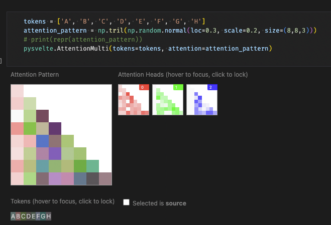
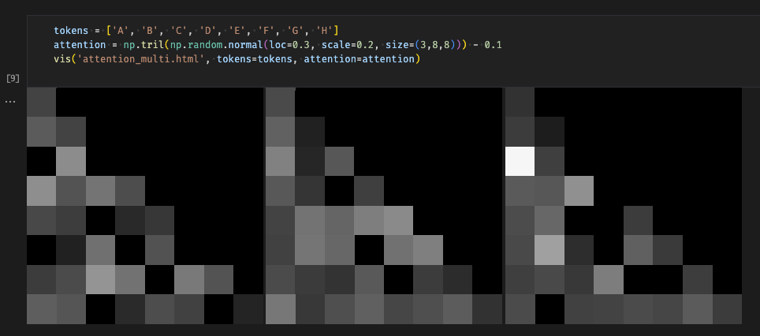

PySvelte is an Anthropic library that lets you write visualisations with web frameworks and embed them in Jupyter notebooks. The open source version is unmaintained and difficult to install, and only includes one visualisation for unidirectional attention patterns, depicted below.

Neel made a fork at https://github.com/neelnanda-io/PySvelte#pysvelte which I worked on for a day or so. The library lets you write visualisations in Svelte, a web framework, and then compiles them to normal HTML using Webpack + NPM and then injects the result into the page. As it depends on node and has a compilation step and doesn't include a setup file, it's fairly difficult to install in many environments like Colab notebooks, and it's fairly slow.

Since deciding the library should be simplified, I've been reimplementing a much simpler version of PySvelte that's faster to install and run, more portable, and easier to understand. Instead of using node, Svelte and a compilation step, it uses the Web Components browser standard and a vanilla JavaScript library called Lit (https://lit.dev). This tradeoff means the library is just a small assortment of plain Python and HTML files, so it's very portable and fast. The choice of Lit + Web Components also means the development experience is functionally the same: Svelte code looks almost identical except for the non-standard syntax (hence the compilation step).

So far I've built the basic infrastructure needed to use Web Components in IPython and a small part of the attention pattern visualiser, depicted below. (Work in progress here: https://github.com/OliverBalfour/vis)

The entire library is about 150 lines so far, so I'm confident this was the right design choice.

Next steps include making a bunch more visualisations, demos, documentation, integration with Neel's Easy-Transformer library, and publishing. I've secured a grant to fund this work.
